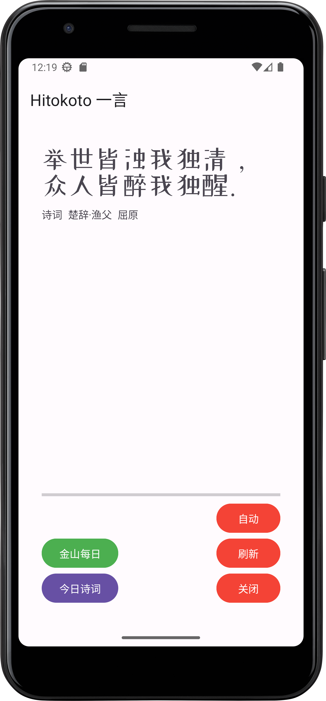
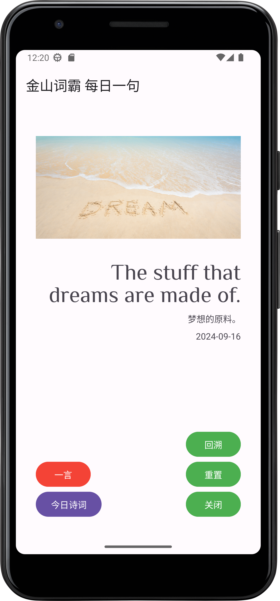
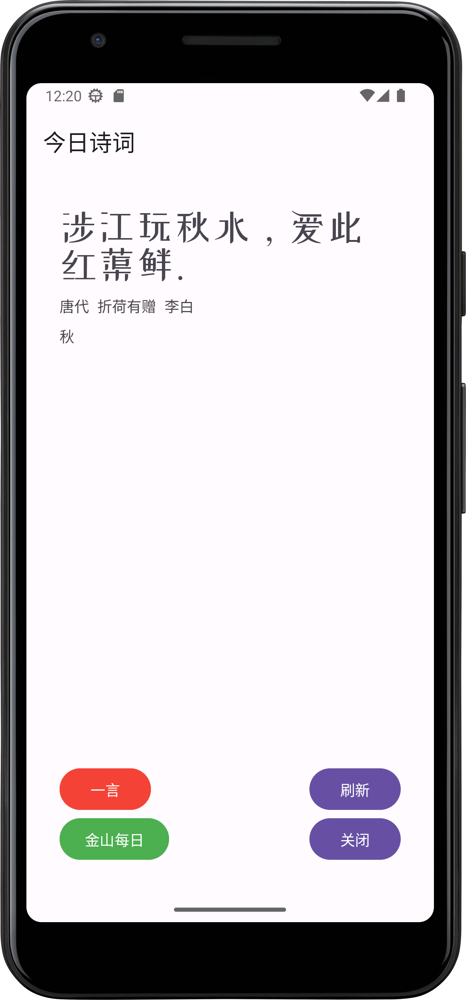

It is to be a classical android app written in java, display one line of text from some public APIs or open-source database in the screen. 

- [x] 一言：https://hitokoto.cn/
- [x] 词霸，古诗：https://github.com/vv314/quotes
- [ ] 其他：https://github.com/stars/shyu216/lists/dataset

## Screenshots

